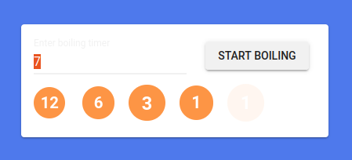

# Frontloop - Elements Challenges - Boiling Dots

This is a solution to a [Frontloop challenge](https://frontloops.io/).
Frontloop powers up your frontend development skills with real-world challenges.

## Table of contents

- [Overview](#overview)
  - [Screenshot](#screenshot)
  - [Links](#links)
- [My process](#my-process)
  - [Built with](#built-with)
  - [What I learned](#what-i-learned)
  - [Continued development](#continued-development)
  - [Useful resources](#useful-resources)
- [Author](#author)

## Overview

### Screenshot

### Links

- Solution URL: https://github.com/delaguilaluis/boiling-dots
- Live Site URL: https://delaguilaluis.github.io/boiling-dots

## My process

### Built with

- Mobile-first workflow
- TypeScript
- [React](https://reactjs.org/) - JS library
- [React Spring](https://react-spring.dev/)
- [Next.js](https://nextjs.org/) - React framework
- [Material UI](https://mui.com/) - Design System

### What I learned

- Improve my understanding of React's useState and useEffect, the rendering
  lifecycle and its interaction when using timers.
- Usage of react-spring (and how amazing it is!).

### Continued development

- Areas that I want to continue be focusing on in future projects:
  - Timers interaction with useEffect

### Useful resources

- [Build a React Timer Component Using Hooks](https://upmostly.com/tutorials/build-a-react-timer-component-using-hooks)
- [Boop!](https://www.joshwcomeau.com/react/boop/)
